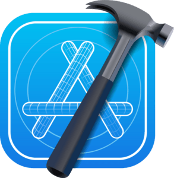

<!-- ### Hello there  Welcome to my GitHub! I'm Anton Ustinoff, frontend developer. -->
<!-- ### Hi there 👋 
#### Welcome to my GitHub!
#### My name is Anton Ustinoff. I am the frontend developer. -->
 

 

<!--  -->

### Connect with me 👇
#### Use dark theme to find my socials 😉

<a href="https://www.instagram.com/eyeofantonustinoff/" target="_blank">

 
 

### Languages and Tools:

 
 

### Softwares:

 
 

---

### Music for development 🎧

 
---

 

<!--  

 -->
